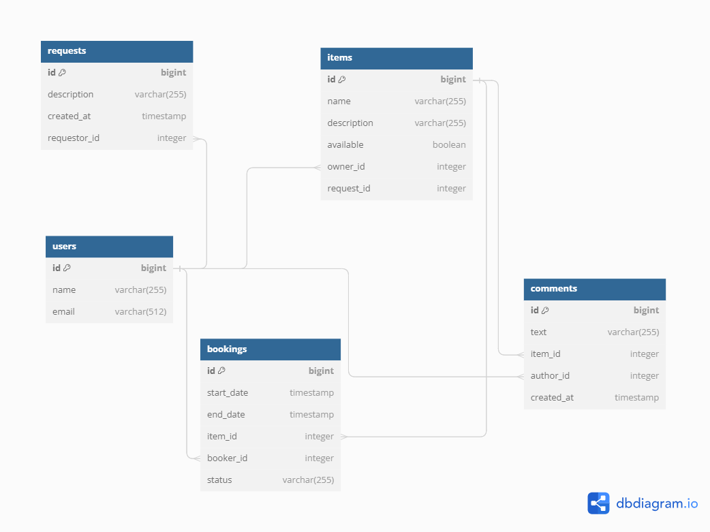

# Share it

### Стек:

- Java 11
- Spring Boot
- PostgreSQL
- Hibernate
- JPA
- Maven
- Lombok
- Mapstruct
- JUnit 5

# Описание проекта

Share it - это REST-приложение для сдачи вещей в аренду. Если пользователю временно не нужна какая-то вещь, он может
добавить
ее в список доступных для бронирования. После этого другой пользователь может создать заявку на бронирование и
использовать
вещь. Приложение разделено на два микросервиса - gateway и server. Gateway отвечает за получение запросов от
пользователей
и их валидацию, в то время как server обрабатывает запросы. Функциональность приложения протестирована при помощи юнит и
интеграционных тестов.

## Функционал приложения

### Пользователи

- создание пользователя
- обновление пользователя
- получение пользователя по ID
- получение списка всех пользователей
- удаление пользователя

### Вещи

- создание вещи
- обновление вещи
- получение вещи по ID
- получение списка вещей, владельцем которых является определенный пользователь
- поиск вещей
- добавление комментария к вещи

### Бронирования

- создание бронирования
- получение бронирования по ID
- подтверждение бронирования владельцем вещи
- получение бронирований, созданных определенным пользователем
- получение бронирований по вещам, владельцем которых является определенный пользователь

### Запросы на бронирование

- создание запроса на бронирование
- получение запроса по ID
- получение списка запросов, созданных другими пользователями
- получение списка запросов, созданных определенным пользователем

## Запуск приложения

1. Установите Docker на ваш компьютер: https://docs.docker.com/engine/install/
2. Клонируйте репозиторий: git pull https://github.com/Alex-Naumenko1986/java-shareit.git
3. Войдите в проект и создайте jar файлы: mvn package
4. Запустите приложение: docker-compose up -d

## Схема базы данных

